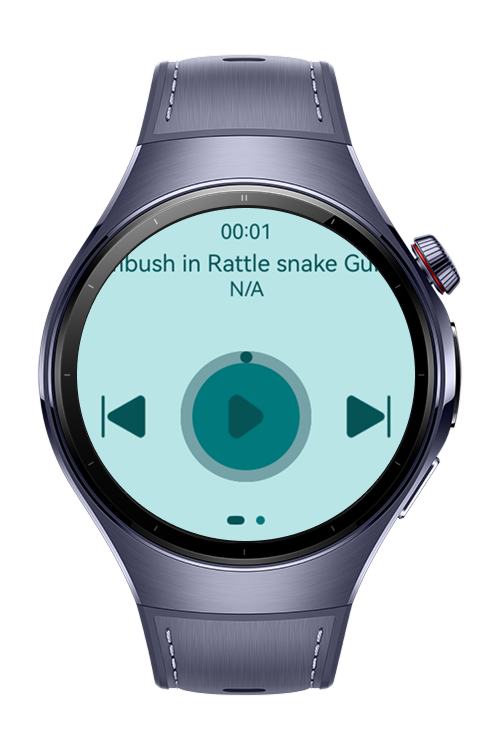
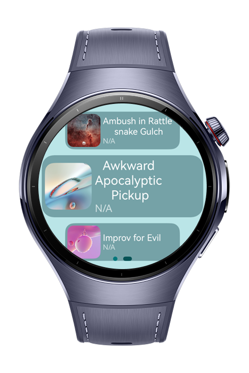

> **Note:** To access all shared projects, get information about environment setup, and view other guides, please visit [Explore-In-HMOS-Wearable Index](https://github.com/Explore-In-HMOS-Wearable/hmos-index).

# Music Player App

This demo showcases a simple but functional mobile app that allows users to listen to the music on their device with an
easy and intuitive interface. The app consists of two main screens:
The application enables users to:

- Music Player Page: Through this page, users can start, pause, and switch to the next or previous song.
- Playlist Page: From this page, which lists all the songs available on the device, the user can select any song and
  start playing.
  This app is extremely easy to use and offers the music listening experience in a simple yet effective way.

# Preview

<div>


</div>

# Use Cases

Music Player App is designed to make the music listening habits of users in their daily lives more enjoyable and
practical. The following are the application's featured use cases:

- Daily Music Listening: Users can quickly listen to their favorite songs on their way to work, studying, or exercising.
- Quick Access with Simple Controls: Start, stop, and switch to the next or previous track can be easily performed from
  the app's home screen.
- Single Screen Access to All Songs: The playlist page lists all the music on the device and the user can select any
  song and start playing instantly.
- Track Transitions: Users can freely enjoy personal music by quickly exiting an existing song and switching to other
  tracks.

# Technology

## Stack

- Languages: ArkTS
- Frameworks: HarmonyOS SDK 5.0.0(12)
- Tools: DevEco Studio Vers 5.1.0.823
- Libraries
    - `@kit.ImageKit`: Used for image processing (capturing, editing, previewing images).
    - `@kit.AbilityKit`: Permission Check and Request
    - `@kit.LocalizationKit`: Supports multilingual translation and app localization.
    - `@kit.CoreFileKit`: Used for file management, such as reading, writing, and organizing files.
    - `@kit.MediaKit`: Provides capabilities for audio and video playback or recording.
    - `@kit.BasicServiceKit`: Used for basic system services, like data sharing and service status monitoring.
    - `@kit.PerformanceAnalysisKiy`: Used to analyze app performance, including memory and CPU usage.

## Required Permissions

- `ohos.permission.KEEP_BACKGROUND_RUNNING`

# Directory Structure

```
entry/src/main/ets/
├───pages
│       Index.ets
│
├───components
│       SongCardComponent.ets
│
├───model
│       DataModel.ets
│
├───constants
│       AppFontSize.ets     
│       AppFontWeight.ets 
│       GridConstants.ets 
│       ImageConstants.ets 
│       SizeConstants.ets    
│
├───utils
│       AVSessionController.ets
│       BackgroundUtil.ets
│       MediaController.ets
│       MediaTools.ets
│
├───view
│       PlaybackView.ets
│       PlayPauseButton.ets
│       SongListView.ets
│
├───viewmodel
│       SongData.ets
│       SongDataSource.ets
│       WearableViewModel.ets
│
├───entryability
│       EntryAbility.ets
│
└───entrybackupability
        EntryBackupAbility.ets

```

# Constraints and Restrictions

## Supported Device

- Huawei Watch 5

# License

Music Player App is distributed under the terms of the MIT License. See the [LICENSE](/LICENSE) for more information.